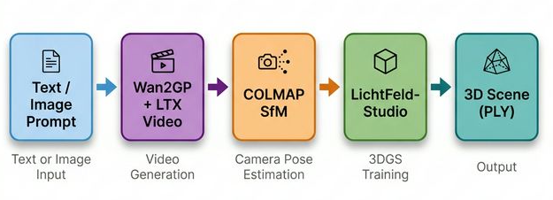

# Individual Project - Generative Scene Generation



## Table of Contents

- [Overview](#overview)
- [Project Goals](#project-goals)
- [Methodology](#methodology)
- [Pipeline](#pipeline)
- [Usage](#usage)
    - [Wan2GP](#wan2gp)
    - [LichtFeld-Studio pipeline](#lichtfeld-studio-pipeline)
      - [Docker](#docker)
      - [Commands only](#commands-only)
- [Sources](#sources)
- [Author](#author)

## Overview

This project, **Generative Scene Generation**, explores how **AI-generated visual content** (images and videos) can be used to construct **3D scenes** through the process of **3D Gaussian Splatting**. The work combines insights from computer vision, deep learning, and 3D reconstruction to evaluate the potential of generative models for creating realistic 3D environments from synthetic data.

The videos will be created using the Wan2GP project, and for the conversion between video to 3D Gaussian Splatting, LichtFeld-Studio will be used.

## Project Goals

- Study the **3D Gaussian Splatting** paper and related research to understand the theoretical framework behind the technique.
- Investigate how **3D Gaussians** can represent 3D space derived from **AI-generated imagery**.
- Develop a **practical implementation** that uses open-source **AI image** and **video generation** tools to create visual data, which will then be processed with **COLMAP** (or other software) and **3D Gaussian Splatting** to form a 3D scene.
- Compare the AI-generated 3D reconstruction with a **real-world 3D scan**, identify the limitations, and propose potential improvements or solutions.

## Methodology

1. **Data Generation:** Use open-source AI models to produce images and videos as input.
2. **3D Reconstruction:** Employ **COLMAP** for structure-from-motion (SfM) processing and **3D Gaussian Splatting** for scene representation.
3. **Comparison and Analysis:** Evaluate how the AI-generated reconstruction differs from real-world 3D data and discuss corrective techniques.

## Pipeline

```markdown
1. Video Upload
2. COLMAP Pipeline (./pipeline_colmap.sh)
3. LichtFeld-Studio GUI (./build/LichtFeld-Studio)
4. ZIP Creation
5. Download Results
```

## Usage

In Linux, make sure to run the following commands:

```
xhost +local:docker
xhost +local:root
```

Possible issue when you're working on this: Black LichtFeld-Studio screen, can't exit. Solution: `xhost +local:docker; xhost +SI:localuser:$(whoami)` and inside the container: `unset __NV_PRIME_RENDER_OFFLOAD; unset __GLX_VENDOR_LIBRARY_NAME`. After this you should be able to run: `./build/LichtFeld-Studio`, and thus can run the app using: `python app.py`

Those commands allow Docker containers to access your host's X11 display server. COLMAP tries to create an OpenGL context, which requires X11 access even in "offscreen" mode. `xhost +local:root` and `xhost +local:docker` grant the necessary permissions for the containerized application to connect to your display server for GPU/OpenGL operations. Without these, Docker can't create the OpenGL context, causing the following crash:

```bash
opengl_utils.cc:54] Check failed: context_.create()
*** Check failure stack trace: ***
    @     0x7f52c1434031  google::LogMessage::Fail()
./pipeline_colmap.sh: line 141: 276472 Aborted                 (core dumped) colmap feature_extractor --database_path "$PROJECT_DIR/database/database.db" --image_path "$PROJECT_DIR/images" --ImageReader.single_camera 1 --ImageReader.camera_model OPENCV

❌ COLMAP failed with exit code 134
```

Another possible issue:

```bash
./build/LichtFeld-Studio: /lib/x86_64-linux-gnu/libm.so.6: version GLIBC_2.38' not found (required by ./build/LichtFeld-Studio)
./build/LichtFeld-Studio: /lib/x86_64-linux-gnu/libc.so.6: version GLIBC_2.36' not found (required by ./build/LichtFeld-Studio)
./build/LichtFeld-Studio: /lib/x86_64-linux-gnu/libc.so.6: version `GLIBC_2.38' not found (required by ./build/LichtFeld-Studio)
```

This issue can exist when your system doesn't have the right packages because it might be too old. You're trying to run it on your host system, which has an older GLIBC. Solution: only run the LichtFeld-Studio binary inside the docker container.

### Wan2GP

The Wan2GP folder contain the source code of the [Wan2GP project](https://github.com/deepbeepmeep/Wan2GP). Install and run it by running the following commands:

```bash
cd Wan2GP
pip install -r requirements.txt
python wgp.py
```

You should be able to see that the gradio server has started running, and you can visit the page by going to: `localhost:7860`

### LichtFeld-Studio pipeline

#### Docker

Run the following commands to start the LichtFeld-Studio pipeline

```bash
# Start docker
sudo systemctl start docker

# Start the building process of the LichtFeld-Studio project
./docker/run_docker.sh -bu 12.8.0

# Run the gradio server (inside the container), navigate to http://localhost:7860
python3 app.py
```

#### Commands only

1. Create a video file and place it in the current folder
2. Run the file: `./install_colmap.sh` (if colmap isn't installed already)
3. Run the file: `./pipeline_colmap.sh <video.mp4> <new_project_dir_name> <fps>`
4. Run the following command: `./build/LichtFeld-Studio -d <colmap_project_dir_name> -o output/<folder_name> --gut`
5. In the GUI of LichtFeld-Studio, train the model on the images
6. Check if the folder `output/<folder_name>` contains a `.ply` file.
7. Done

## Sources

- Wan2GP: <https://github.com/deepbeepmeep/Wan2GP>
- LichtFeld-Studio: <https://github.com/MrNeRF/LichtFeld-Studio>

## Author

- Denis Topallaj
- Individual Project – Generative Scene Generation
- University of Hasselt, 2025-2026
