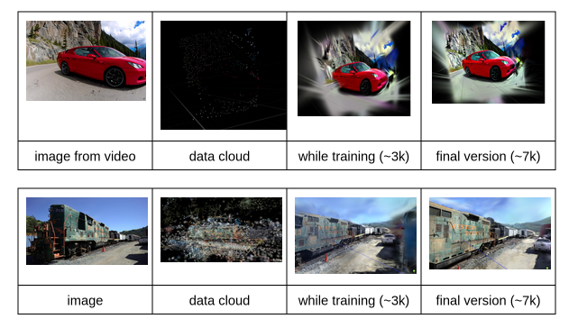
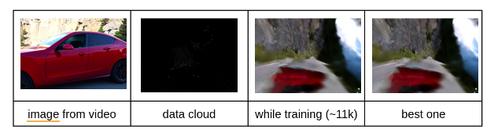
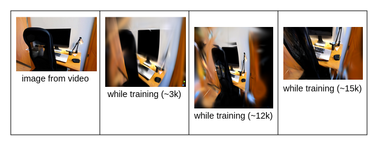
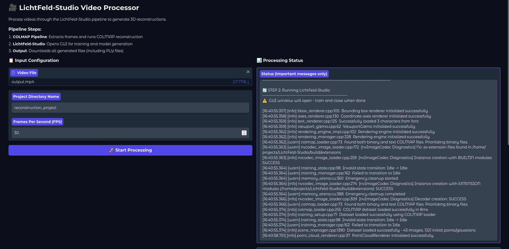
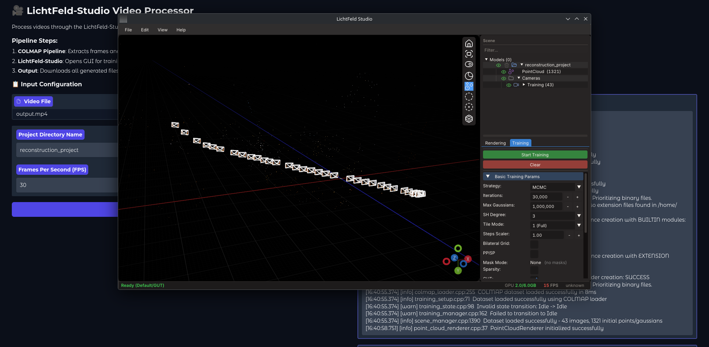
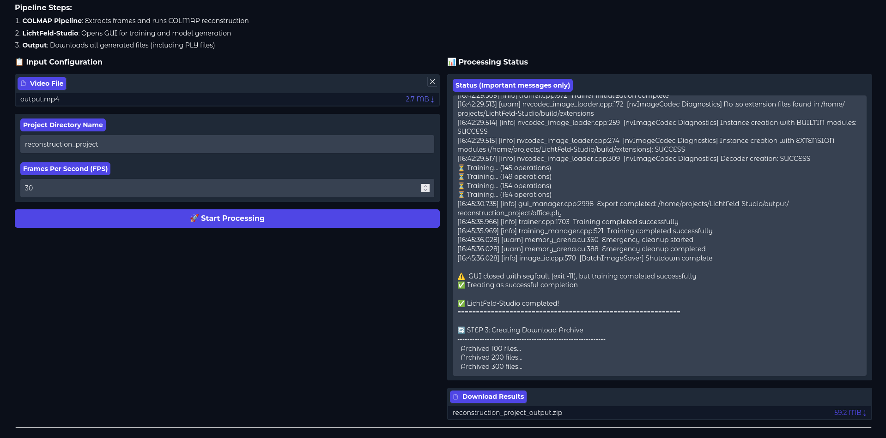
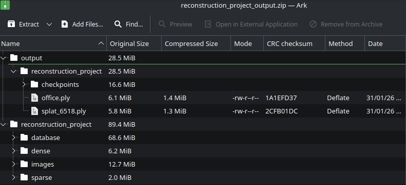

# Individual Project Progress

AI Video Generation + 3D Gaussian Splatting

Denis Topallaj

---

# Project Goal

<div class="leading-relaxed">

Generate AI videos from text descriptions and use them to train **3D Gaussian Splatting models**

Compare results with real videos as ground truth

</div>

---

# Timeline

<div class="leading-relaxed">

**Project Duration**

- September - December 2025
- 6 Meetings total

**Next Phase**

- February 9 - June, 2026

**Meetings**

1. September 30
2. October 14
3. October 28
4. November 18
5. December 2
6. December 16

 </div>

---

# Early October Exploration & Setup: Key Activities (7-13)

- Researched multiple Gaussian Splatting implementations
- Successfully deployed **LichtFeld-Studio** (GUI-based, Linux)
- Learned **COLMAP** for image conversion to sparse format
- Started reading Gaussian Splatting paper
  - Detailed notes in Xournal++
- Identified GPU limitations: only 300MiB usable out of 6.1GiB

---

# First Successful Pipeline Mid October (15-18)

## Successfully generated videos in Google Colab

**Models Used:**

- Image: `stabilityai/stable-diffusion-2-1` (~8min)
- Video: `THUDM/CogVideoX-2b` (~25min on T4 GPU)

**Critical Bug Fix:**

```python
# Error: CLIPTextModel.__init__() got unexpected keyword argument
# Solution:
transformers==4.49
diffusers==0.32.2
```

**Pipeline Created:**
Text → Video → COLMAP → LichtFeld-Studio → 3D Model

---

# Multi-Angle Video Experiments Results Late October (21-27)

| Test   | Videos     | Images (COLMAP) | Images Used | Iterations | Quality         |
| ------ | ---------- | --------------- | ----------- | ---------- | --------------- |
| Test 1 | 1 (6s)     | 3               | 3           | 30k        | Decent          |
| Test 2 | 4 combined | 245             | 61          | 3k-20k     | Better depth    |
| Test 3 | 7 combined | -               | -           | 3k-15k     | **Best result** |

---

# Test 1 (Oct 21)

- 6-second video
- 3 images extracted
- Result: "Pretty ok" for limited data
- Challenge: Training difficult with so few images

<div class="text-right">
  
</div>

---

# Test 2 (Oct 23)

- 4 video variations combined (~20min each)
- 245 images extracted from COLMAP
- **Only 61 images used in training**
- Result: Better depth visible
- (Completed reading Gaussian Splatting paper)



---

# Test 3 (Oct 27)

- 7 videos from different prompts
- Combined into single video using ffmpeg
- Result: Best reconstruction so far
- Quality loss remain significant
- Prompts must be extremely precise
- Only a tiny section from the full video was used



---

# Infrastructure Work

**Docker Implementation**

- Started containerization (~17GB+ data)
- Fixed LichtFeld-Studio visualization in Docker
- CUDA issues remain (ongoing)

**Key Features:**

- Mounted data folders for easy file transfer
- Shell scripts for automated pipeline

---

# November (1-22) Achievements

**Software Development**

- Set up GitHub repository (Nov 15)
- Fixed Docker container (Nov 22)
  - Can create/clear/delete containers
  - Run commands programmatically

**Academic Writing (LaTeX/Overleaf)**

- Completed NeRF section (Nov 7)
- Completed 3D Gaussian Splatting section (Nov 14)

---

# December Activities

- Fixed Dockerfile errors
- Created frontend/backend general structure
- **Strategic Decision:** Prioritize CLI over GUI initially
- Couldn't work too much (exams, other projects etc)

---

# Repositories Tested

1. `github.com/camenduru/gaussian-splatting-colab`

    - Package issues

2. **LTX-Video**

    - GPU memory limitations

3. `github.com/deepbeepmeep/Wan2GP`

    - Supports Wan 2.1/2.2, Qwen, Hunyuan, LTX, Flux
    - Too resource-intensive

4. `Wan-AI/Wan2.1-T2V-1.3B-Diffusers`
    - Needs 20GB+ RAM

---

# More Repositories

5. `THUDM/CogVideoX-5b-I2V`

    - Timeout on Colab

6. `Tencent/hunyuanvideo-1.5`

    - Too large (200GB+)

7. `Facebook I2V model`
    - Work in progress

---

# Critical Insights

1. **Image Count Matters**
    - Real datasets: 5,300+ images
    - AI-generated: 672 images
    - Impact: Significant quality difference
2. **Model Size Trade-off**
    - Smaller models (1-2B params) = faster
    - But: poor quality
3. **Prompt Precision**
    - T2V models need extremely detailed descriptions
    - Example: Must specify "monitor on/off"

---

# Technical Challenges

- Package compatibility issues across T2V models
- GPU memory constraints
  - Local: 6.1GB available, only 300MB usable
- CUDA configuration in Docker
- Colab time/memory limitations

---

# Goals

1. Test on UHasselt GPUs

    - Create videos using GPUs to have something to work with
    - Generate using different techniques

2. Compare the different techniques

3. Finish paper

    - Can't be finished without having some results

4. Prepare end-of-semester presentation

---

# Frontend using gradio - 1



---

# Frontend using gradio - 2



---

# Frontend using gradio - 3



---

# Frontend using gradio - 4



---

<SlidevVideo v-click autoplay controls>
  <source src="./office.mp4" type="video/mp4" />
</SlidevVideo>
